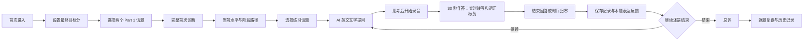

# 雅思口语 Part 1 AI 实时教官 MVP PRD

## 文档信息

| 字段 | 内容 |
| --- | --- |
| 版本 | 0.1（需求确认稿） |
| 日期 | 2026-08-08 |
| 产品范围 | Web 端 Part 1 学习闭环 |
| 目标用户 | 当前口语约 5.0 分、希望提升至 6.5 分及以上的雅思备考者 |
| 状态 | 可进入产品设计与技术评估 |

## 1. 执行摘要

本 MVP 是一名面向雅思口语 Part 1 的 AI 实时教官。用户先设定最终目标分并完成一次完整的 Part 1 诊断，系统根据真实语音表现建立当前水平与阶段训练目标。之后用户自主选择 Part 1 话题作为本次练习的起始话题，AI 以英文文字逐题提问，并按真实 Part 1 节奏在每个话题完成三问后切换到下一个话题。用户在 30 秒内作答时可看到实时转写及仅针对词汇表达的黄色提升标记；每题完成后获得转录稿、阶段匹配的推荐回答与标黄词汇汇总，不做单题判分。整次 Part 1 练习结束后才呈现训练预估、总评和逐题复盘。

最终目标分不直接决定当前建议难度。系统会将用户带入一个可修改的阶段目标，例如当前 5.0 分、最终目标 8.0 分时，先按 6.5 分提供建议，稳定后再推进至 7.0 分和 8.0 分。该机制的价值在于让用户获得可模仿、可复用的下一步表达，而不是被与当前能力断层的高分范文淹没。

## 2. 问题陈述

### 谁遇到这个问题

主要面向当前口语约 5.0 分、目标 6.5 分或以上的雅思备考者。他们有基础表达能力，也能找到题库和范文，但缺少能在练习中即时指出问题、按自身阶段带练的教练。

### 用户问题

现有练习通常存在以下断裂：

- 题库只提供题目，用户不知道自己的答案属于什么水平。
- 范文往往直接按高分标准给出，与当前能力不匹配，难以模仿和迁移。
- 用户说完后没有及时看到自己的转写、用词问题和改善方向，难以建立“说法 - 问题 - 改法”的联系。
- 历次作答没有按考季、Part、话题和问题沉淀，用户重复进入同一题目时无法从历史表现继续练。

### 为什么痛苦

- **用户影响**：练了很多题却不知道应先改什么；容易背答案，无法在陌生追问中自然组织语言；对进步缺少证据感。
- **产品影响**：若反馈不及时、难度不匹配或历史记录不可用，用户无法感受到“实时教官”的差异，也难以形成复练习惯。

### 证据与边界

- 已确认的产品方向来自本轮产品讨论：用户明确要求实时转写、词汇标黄、逐题记录、阶段目标与 Part 1 先行。
- British Council 的公开 Part 1 练习说明指出：Part 1 围绕熟悉话题提问，建议时长为 4-5 分钟；示例以两个话题、每个四题作为官方考试的合理参照。[来源](https://takeielts.britishcouncil.org/take-ielts/prepare/free-ielts-english-practice-tests/speaking/part-1)
- 🔶 假设：目标用户会因实时转写和阶段匹配建议而显著提高复练与留存。上线前尚无访谈、使用数据或转化基线支持。

## 3. 目标用户与待完成任务

### 主用户画像

| 维度 | 定义 |
| --- | --- |
| 用户 | 正在备考雅思、口语约 5.0 分的学习者 |
| 目标 | 在有限时间内，稳定提升至 6.5 分或更高分数段 |
| 典型障碍 | 能表达基本意思，但词汇重复、句子不自然、回答短或缺少展开；不知道怎样从当前答案走向目标分 |
| 当前行为 | 看题库、背范文、录音自听，或请老师批改；反馈延迟且难以持续记录 |
| 使用情境 | 每次用 5-15 分钟完成一个话题练习或一次完整 Part 1 诊断 |

### Jobs to Be Done

- **功能任务**：当我练习一个 Part 1 话题时，我想知道自己刚刚说了什么、哪里最值得改、下一次该如何表达。
- **情感任务**：我希望感到自己是在稳步提升，而不是被 8 分范文证明自己差得很远。
- **结果任务**：我希望在进入同一话题或问题时，能直接看到过去的表现并继续练，而不是从零开始。

## 4. 产品目标与范围

### 本 MVP 的目标

1. 让新用户完成一次可信的 Part 1 初始诊断，并得到当前水平、最终目标和当前训练目标。
2. 让用户完成“AI 提问 - 语音作答 - 实时转写/词汇提示 - 诊断 - 下一题”的连续练习。
3. 让每次作答成为可回看的历史记录，并在一次练习结束时形成先总后逐题的复盘。
4. 让 AI 给出的建议始终贴合当前训练阶段，而不是直接对齐最终目标分。

### 非目标

- 不在首版覆盖 Part 2、Part 3、真实留学场景或完整框架库。
- 不做题目语音朗读、AI 语音对话或边说边语音打断。
- 不在实时界面标记语法和句子结构问题；实时黄色标记仅用于词汇表达。
- 不承诺官方雅思分数，不以单题分数更新用户总体水平。

## 5. 核心定义与产品规则

### 5.1 分数定义

| 名称 | 定义 | 用途 |
| --- | --- | --- |
| 本次练习预估 | 基于本次 Part 1 会话内已完成回答的训练用途预估 | 在用户结束练习后呈现，不能归因到某一道问题 |
| 当前综合水平 | 基于完整首次诊断及后续多次记录形成的稳定判断 | 生成阶段路径，不由单题直接改写 |
| 当前训练目标 | 系统当前用来生成词汇、改写和建议的分数段 | 决定建议难度，可由用户修改 |
| 最终目标分 | 用户设定的长期目标 | 展示长期方向，不直接决定当下建议 |

示例：初始水平为 `5.0`、最终目标为 `8.0` 时，系统可以规划 `6.5 -> 7.0 -> 8.0`。当前训练目标为 6.5 时，所有实时词汇建议、目标表达和详细改写均按 6.5 分生成；用户稳定达到当前阶段后，系统才建议进入下一阶段。

🔵 待确认：何种样本量、稳定性和四项能力阈值构成“可升级到下一阶段”的判定。MVP 可先提供系统建议与用户确认升级，不自动强制升级。

### 5.2 题库、话题与追问

- 题库的一级学习实体为“话题”，而不是预先固定的问题序列。
- 话题至少包含：考季、Part（本 MVP 固定为 Part 1）、话题名称、来源和状态。
- 用户进入练习时选择一个起始话题；开始后不预览问题列表。
- AI 教官每次只显示一道英文问题。一个话题默认三问；AI 只在用户回答信息不足、需要澄清时追加最多一问针对性追问。完成该话题后，系统先展示话题总结；用户确认进入下一话题后，才按所选考季切换。
- 一次模拟练习通常覆盖 2-3 个话题、总计约 4-5 分钟；用户仍可在任一题反馈后主动结束本次练习。
- AI 生成的每一道问题及其上游回答关系必须持久化，以支持复盘、审计和按历史话题回看。
- 从话题入口发起新练习时，用户不预览问题；从历史记录直接进入一个已练习话题时，系统先展示该话题的历史训练，再由用户主动开始新一轮话题练习。两种入口不得混淆。

🔶 假设：受约束的生成式追问可在保持自然感的同时维持 Part 1 的难度与范围。需通过教研审核样本验证。

## 6. 用户流程

### 6.1 首次诊断流程

1. 新用户先设置最终目标分。该目标可在后续修改。
2. 用户自主选择两个 Part 1 话题，不预览具体问题。
3. AI 在两个话题中逐题追问；首次诊断要求完成完整 Part 1 模拟，目标为 4-5 分钟、约 8 道有效回答。
4. 用户每题先自行思考，再点击“开始录音”；每题最多 30 秒。
5. 用户完整完成诊断后，系统生成当前综合水平、四项能力概览、当前训练目标和阶段路径。
6. 用户中途退出时保留进度与已完成录音，但不生成正式初始水平；下次可继续该诊断。

### 6.2 常规练习流程

1. 用户按考季和 Part 1 选择本次练习的起始话题。
2. AI 以英文文字提出当前问题，用户仅看到当题。
3. 用户思考后开始录音；倒计时从 `00:30` 开始。
4. 录音期间显示实时转写；稳定识别的词汇表达可显示黄色标记与简短替换建议。
5. 用户点击“结束回答”或倒计时归零后，系统停止录音、完成最终转写并保存记录。
6. 页面展示左侧带黄色词汇标记的转录稿、右侧按当前训练目标生成的推荐回答，以及下方标黄词汇汇总。话题前两问后，用户可选择“下一题”或结束；第三问后，主操作改为“完成话题练习”，进入该话题的总结页。
7. 话题总结页先给出话题汇总评价，再按作答顺序展示每一道追问：原始录音置顶，其下复用该题的转录稿、推荐回答和标黄词汇汇总。页面底部提供“结束本次练习”和“进入下一话题”。只有点击后者才打开大确认弹窗；确认后 AI 才展示下一话题第一问。用户可在弹窗中结束练习或返回话题总结。
8. 用户可在任一题完成后点击“结束本次练习”。只完成一个话题时，结束页仅确认已保存并提供话题总结、其他话题和历史训练入口；完成两个及以上话题时，结束页提供跨话题总评与话题总结入口，不重复逐题内容。

## 7. 功能需求

### FR-01 目标分与阶段路径

| 项目 | 要求 |
| --- | --- |
| 最终目标分 | 新用户必须在首次诊断前设置；后续可修改。 |
| 当前水平 | 仅在完成首次完整诊断后生成正式值。 |
| 当前训练目标 | 系统根据当前水平与最终目标自动规划，用户可修改。 |
| 建议难度 | 所有实时词汇建议、详细改写及诊断建议必须以当前训练目标为准。 |
| 阶段升级 | 系统基于多次记录提示升级；用户确认后才切换当前训练目标。 |

### FR-02 话题选择与 AI 追问

| 项目 | 要求 |
| --- | --- |
| 练习入口 | 页面名称为“练习”。先选择年份，再选择口语 Part；入口布局保留 Part 1、Part 2、Part 3 的选择位置。MVP 只开放 Part 1，Part 2 与 Part 3 必须明确标记为暂未开放，不能误导用户进入不可用练习。 |
| 话题选择 | 用户在首次诊断和常规练习中均自行选择话题。首次诊断需选择两个话题；从话题入口开始时不预览问题。 |
| 问题展示 | 仅展示当前英文问题，不在作答前显示后续问题或中文译文；从历史记录进入时，先展示该话题下已保存的历史训练。 |
| 话题节奏 | 每个话题默认三问。仅当回答不足以支持自然衔接时，可追加最多一问针对性追问；之后切换到下一个话题。 |
| AI 追问 | 下一问题综合话题、上一题、回答内容和轮次生成；不得跳出熟悉日常话题或提前给出答案。 |
| 防偏题 | 生成失败、回答为空或话题偏离时，AI 可要求用户补充/重答，或回到同一话题的安全问题。 |
| 记录 | 每道生成问题都保存问题文本、生成时间、父问题/回答关系和所属话题。 |

### FR-03 录音、倒计时与实时转写

| 项目 | 要求 |
| --- | --- |
| 提问方式 | 首版只显示英文文字，不合成或播放题目语音。 |
| 开始方式 | 用户点击“开始录音”后才请求/启用录音与倒计时。 |
| 时长 | 每题固定 30 秒；用户可提前点击“结束回答”；时间归零时自动结束。 |
| 实时转写 | 录音过程中显示持续更新的英文转写，最终以服务端/最终识别文本为准。 |
| 黄色标记 | 仅标记可提升的词汇表达；不在作答时显示语法、句子结构或长篇解释。 |
| 保存 | 保存录音、最终转写，以及带时间戳的实时转写片段与黄色标记事件。 |

### FR-04 单题表达反馈与详细复盘

本题完成后，系统先提供不打断下一题节奏的表达反馈：

- 左侧展示最终转录稿；仅将可提升的词汇表达标为黄色。
- 右侧展示按 `activeStageBand` 生成的推荐回答，保留用户原回答的意图与主要信息，不直接给出最终目标分难度的范文。
- 下方汇总本题所有标黄词汇，包含原表达、建议表达与简短使用说明。
- 用户悬停、键盘聚焦或移动端点击转录稿中的黄色表达时，下方汇总区只展示对应词条；鼠标移开或焦点离开后恢复全部词条。该交互不得滚动页面。
- 已保存记录状态，以及“下一题”和“结束本次练习”操作；系统不得在未选择“下一题”时自动提问。
- 不显示单题分数、四项能力评分或“优点/优先改进”卡片。

详细复盘中提供：

- 原始录音、最终转写与实时转写轨迹。
- 黄色词汇标记：原表达、建议表达、简短使用说明。
- 语法与句子结构建议，以及保留原意的自然改写。
- 当前训练目标级别的目标表达，而非直接按最终目标分给出范文。
- 中文题意解释仅在复盘详情中提供，不在作答前显示。

### FR-05 话题总结与会话结束页

每次完成一个话题，系统必须提供话题总结：顶部展示该话题的训练预估，并明确标注为训练用途、非官方成绩；话题汇总评价必须解释本次预估的主要依据，并给出下一次练习优先优化的 1-2 个具体点；再按追问顺序展示原始录音、转录稿、推荐回答和标黄词汇汇总。不展示单题分数。该页是话题内所有逐题细节的唯一入口。

用户结束本次练习后，结束页按已完成话题数分支：

1. **仅一个话题**：展示“本次练习已保存”、完成话题和回答数量，并提供该话题总结、选择其他话题和历史训练入口；不得重复展示话题预估、判定依据、逐题记录或逐题详情。
2. **两个及以上话题**：展示本次练习训练预估（标注“训练用途，非官方成绩”）、覆盖话题、回答数量、跨话题最主要的 1-2 个共同问题和下一次训练重点；仅列出已完成话题，每个话题行进入对应的话题总结，不展示按问题排列的列表。
3. **历史入口**：在考季 -> Part -> 话题 -> 问题层级中保留记录；历史列表以话题为单位，按该话题最近练习时间从新到旧排序。打开话题后先展示与话题总结同构的历史训练，再由用户决定是否开始新的话题练习。历史展示不构成必须复练的流程。

### FR-06 历史数据与隐私

- 每条记录至少关联：用户、考季、Part、话题、问题、会话、作答时间和回答序号。
- 用户可回看历史录音、转写和反馈；同一问题的多次回答按时间排序。
- 录音、转写、实时片段和单题表达反馈属于用户学习数据，必须提供查看和删除路径。
- 🔵 待确认：登录方式、默认保存期限、音频存储地区、数据导出和删除的合规要求。

## 8. 数据模型（逻辑层）

| 实体 | 关键字段 | 说明 |
| --- | --- | --- |
| UserProfile | finalGoalBand, currentBand, activeStageBand, stagePlan, diagnosticStatus | 用户的目标、当前水平和阶段路径 |
| Topic | season, part, title, source, status | Part 1 话题；本 MVP 的题库核心实体 |
| PracticeSession | type, selectedTopicIds, status, startedAt, endedAt | `initial_diagnostic` 或 `practice` |
| QuestionTurn | topicId, text, parentTurnId, generationContext, order | AI 当前展示的问题及追问关系 |
| ResponseAttempt | questionTurnId, audioRef, finalTranscript, duration, endedBy | 每次录音作答 |
| LiveTranscriptEvent | responseAttemptId, timestamp, text, isStable | 实时转写的持久化片段 |
| VocabularyHighlight | responseAttemptId, textRange, sourcePhrase, suggestion, status | 黄色词汇标记及建议 |
| ResponseFeedback | responseAttemptId, recommendedAnswer, vocabularyHighlights, grammarNotes, naturalRewrite | 单题表达反馈；不含数值评分 |
| SessionReview | sessionId, practiceTrainingEstimate, confidence, keyFindings, nextAction | 用户结束 Part 1 练习后展示的总评数据 |

## 9. 用户故事与验收标准

### US-01 设置目标并开始诊断

作为一名新用户，我想先设置最终目标分并完成 Part 1 诊断，以便系统能从我的真实表现开始规划训练。

**验收标准**

- [ ] 用户未设置最终目标分时，不能开始首次诊断。
- [ ] 用户可选择两个 Part 1 话题开始诊断，且不看到问题预览。
- [ ] 诊断完成前退出时，系统保存进度但不展示正式当前水平。
- [ ] 完成完整诊断后，系统展示当前综合水平、最终目标、当前训练目标和阶段路径。

### US-02 接受逐题追问

作为一名练习者，我想每次只看到 AI 教官当前的一道英文问题，以便像真实面试一样临场组织表达。

**验收标准**

- [ ] 作答前页面不显示后续问题、中文译文或示例回答。
- [ ] AI 的下一题与当前话题相关，并可引用上一题回答的语义生成自然追问。
- [ ] 每个话题默认三问；只有回答信息不足时才追加最多一问针对性追问，随后切换到下一个话题。
- [ ] 前两问反馈后，用户点击“下一题”才展示下一题；第三问反馈后，用户点击“完成话题练习”进入话题总结，点击总结页的“进入下一话题”才打开确认弹窗，只有确认后才展示下一话题首题；用户可在任意回答后结束本次练习。
- [ ] AI 生成的问题被保存为可回看的历史问题。
- [ ] 生成不可用问题时，系统回退到同一话题的安全追问，而不是中断会话。

### US-03 30 秒录音与实时词汇提示

作为一名练习者，我想在作答时看到实时转写和词汇提升提示，以便及时意识到自己的表达问题。

**验收标准**

- [ ] 用户点击“开始录音”后，倒计时从 30 秒开始。
- [ ] 用户可以提前结束回答；倒计时归零时自动停止录音。
- [ ] 录音期间显示实时转写，最终文本在处理完成后替换为稳定版本。
- [ ] 黄色标记只指向词汇表达；实时区不展示语法或结构解释。
- [ ] 网络短暂中断或转写延迟时，用户的本地录音不丢失，并可重试处理。

### US-04 获得阶段匹配的本题表达反馈

作为一名当前 5 分、目标 8 分的用户，我想得到面向当前阶段的建议，以便先掌握 6.5 分所需表达，而非直接面对 8 分范文。

**验收标准**

- [ ] 每题完成后同时展示带黄色词汇标记的最终转录稿与推荐回答；不显示单题训练预估分或四项能力评分。
- [ ] 推荐回答保留原回答的意图和主要信息，并以 `activeStageBand` 作为难度约束。
- [ ] 标黄词汇汇总展示原表达、建议表达和简短使用说明。
- [ ] 悬停、键盘聚焦或移动端点击转录稿的黄色词汇时，汇总区只展示对应词条；鼠标移开或焦点离开后恢复全部词条，页面位置不变。
- [ ] 修改最终目标分不改写既有记录；后续推荐回答按新的当前训练目标重新生成。

### US-05 查看不重复的结束结果

作为一名练习者，我想在结束练习后只看到当前层级需要的信息，以便不重复阅读已经完成的话题复盘。

**验收标准**

- [ ] 用户只完成一个话题即结束时，页面确认记录已保存，展示话题和回答数量，不重复显示训练预估或逐题列表。
- [ ] 单话题结束页可回到该话题总结、选择其他话题或查看历史训练。
- [ ] 用户完成两个及以上话题即结束时，页面显示训练用途的会话预估、覆盖话题、回答数量、跨话题共同问题与下一次训练重点。
- [ ] 多话题结束页只列出已完成的话题；用户可进入任一话题总结，但不会看到按问题排列的复盘表。

### US-06 继续历史训练

作为一名回访用户，我想在再次进入一个话题时看到上次训练，以便连续回看该话题下的追问并决定是否重新练习。

**验收标准**

- [ ] 历史记录按考季、Part、话题和问题归档，历史列表按话题呈现。
- [ ] 每个话题展示该话题下已保存回答数和最近练习时间；话题内按作答顺序展示录音、转写、推荐回答和表达反馈；不按单题展示分数变化。
- [ ] 用户从历史记录打开一个话题时，先看到该话题的历史复盘；只有主动点击重新练习这个话题后才新增作答记录。
- [ ] 用户可删除单条练习记录；删除后录音、转写、实时片段和反馈均不可再访问。

## 10. 成功指标与埋点

### 主指标

**首次有效训练激活率**：完成首次完整 Part 1 诊断，并在 7 天内完成至少一次常规 Part 1 练习的新增用户占比。

- 🔵 待确认：当前基线、MVP 目标值和观察周期。

### 次级指标

| 指标 | 定义 |
| --- | --- |
| 首次诊断完成率 | 开始首次诊断的用户中完成完整诊断的比例 |
| 单题完成率 | 开始录音后正常结束并获得表达反馈的比例 |
| 实时反馈可见率 | 作答中至少出现一次稳定转写与词汇标记的回答比例 |
| 复盘深度 | 查看至少一条逐题详情的已结束会话比例 |
| 7 日回访练习率 | 首次诊断后 7 日内再次开始 Part 1 练习的比例 |

### 质量与护栏指标

| 指标 | 目标或原则 |
| --- | --- |
| 实时转写延迟 | 🔶 假设：稳定转写应在语音片段结束后约 2 秒内更新；需在技术验证后确定 SLO。 |
| 单题反馈等待 | 🔶 假设：一题结束至转录稿、推荐回答与词汇汇总可见应尽量低于 10 秒；需技术评估。 |
| 多话题会话预估可信度 | 不给出官方成绩；仅在完成两个及以上话题时生成会话预估，证据不足则展示低置信度或不确定性。 |
| 隐私投诉/删除失败 | 必须为零容忍事故，需有可审计的删除流程。 |

### 关键埋点事件

`goal_set`、`diagnostic_started`、`diagnostic_completed`、`topic_selected`、`question_shown`、`recording_started`、`recording_ended`、`timer_expired`、`live_transcript_updated`、`vocabulary_highlight_shown`、`response_feedback_ready`、`vocabulary_summary_linked`、`session_ended`、`session_summary_viewed`、`question_review_viewed`、`history_opened`、`record_deleted`、`stage_target_changed`。

## 11. 非功能需求与边界情况

### 非功能需求

- 响应式 Web 端需支持桌面与手机浏览器；录音按钮和结束按钮的最小可点击区域为 44 x 44 px。
- 录音状态、倒计时、网络/处理状态须同时用文字、图标和非单一颜色表达。
- 转写、推荐回答和跨话题总评生成处理中必须显示可理解的进度状态，不能让用户面对无反馈的等待。
- 训练主流程不得通过模态框承载；用户退出前应明确说明是否保存当前进度。
- 音频与文本传输、存储和访问需使用服务端鉴权及加密方案。🔵 待确认：具体安全与合规标准。

### 边界情况

| 场景 | 期望处理 |
| --- | --- |
| 麦克风权限被拒绝 | 说明权限需求，提供重新授权入口；不可开始录音。 |
| 用户未说话或音频过短 | 不生成伪精确分数，提示重答或补充回答。 |
| 倒计时结束 | 自动停止并保留已录内容；照常进入转写与诊断。 |
| 实时转写修订 | 只对稳定片段生成黄色词汇标记；最终转写更新时同步修正标记位置。 |
| AI 追问超出 Part 1 范围 | 回退到同话题安全问题，并记录生成异常。 |
| 会话预估证据不足 | 在本次练习总评显示低置信度，不更新当前综合水平。 |
| 用户中断首次诊断 | 保存可恢复会话；不生成正式初始水平。 |
| 用户删除记录 | 级联删除录音、转写事件、标记、单题反馈和聚合引用。 |

## 12. 发布范围外

| 项目 | 原因 |
| --- | --- |
| Part 2 与 Part 3 | 先验证 Part 1 的实时教官闭环。 |
| 真实留学场景角色扮演 | 属于更复杂的多轮听说对话，后续再扩展。 |
| 题目语音朗读、语音化 AI 教官 | 首版已确定为英文文字提问，降低 TTS 与交互复杂度。 |
| 实时语法、句子结构标记 | 容易造成认知负担，改在练习详情中处理。 |
| 实时边说边打断纠错 | 会破坏连续表达与考试模拟感。 |
| 完整的个人框架库、相似题网络 | 先验证逐题记录和复盘的学习价值。 |
| 自动强制升级阶段 | 阶段稳定规则尚未校准，首版由系统建议、用户确认。 |
| 官方成绩承诺或考试结果预测 | 产品仅提供训练用途预估，不能替代官方考试。 |

## 13. 依赖与风险

### 依赖

| 类型 | 依赖 |
| --- | --- |
| 题库 | 具备考季、Part、话题来源和状态的 Part 1 话题数据。 |
| 语音 | 浏览器录音能力、稳定的流式语音转写服务。 |
| AI | 受约束的追问生成、词汇建议、阶段匹配推荐回答与 Part 1 跨话题总评服务。 |
| 数据 | 会话、录音、实时转写事件、单题反馈与历史记录的持久化存储。 |
| 体验 | 录音权限、加载/失败状态、移动端录音兼容性设计。 |

### 风险与缓解

| 风险 | 影响 | 缓解措施 |
| --- | --- | --- |
| AI 追问偏离 Part 1 | 损害考试模拟可信度 | 通过话题范围、轮次、敏感内容和输出长度约束；生成失败回退到安全问题。 |
| ASR 延迟或误识别 | 实时标记不可信，打断作答 | 只在稳定片段标黄；保留最终转写修订与重试机制；记录延迟指标。 |
| 话题预估不稳定 | 用户误解自身水平 | 明确其为话题训练预估并展示置信度；单题不评分或更新综合水平；用多次会话样本更新阶段。 |
| 目标建议跳级 | 用户无法模仿建议 | 以当前训练目标生成反馈；阶段可修改，升级需用户确认。 |
| 音频和转写隐私 | 合规与信任风险 | 明示采集用途、提供删除能力、最小化保存与权限控制。 |
| 诊断流程过长导致退出 | 无法取得初始水平 | 显示进度与预计时长；中断可恢复；监控完成率并迭代题量/引导。 |

## 14. 待确认事项

| 事项 | 影响 | 建议负责人 | 状态 |
| --- | --- | --- | --- |
| 分阶段升级的样本量与判定规则 | 决定何时从 6.5 推进至 7.0 | 教研 + 产品 | 待确认 |
| 本次练习预估模型与校准方法 | 决定总评可信度与置信度呈现 | 教研 + AI 工程 | 待确认 |
| Part 1 话题来源、考季更新和使用授权 | 决定题库质量与合规性 | 内容运营 + 法务 | 待确认 |
| 账号、存储期限与数据删除策略 | 决定历史记录实现与隐私合规 | 产品 + 工程 + 法务 | 待确认 |
| 转写与话题预估服务的延迟 SLO、成本上限 | 决定实时体验和技术选型 | 工程 + 产品 | 待确认 |
| 是否在首版开放移动 Web | 影响录音兼容性和测试范围 | 产品 + 工程 | 待确认 |

## 15. PRD 自检

### 最强部分

核心用户闭环、学习阶段机制、Part 1 提问逻辑和逐题记录规则已经在产品讨论中明确，可直接进入交互设计与技术方案评估。

### 最弱部分

成功指标没有现有基线，话题预估校准、题库来源与音频数据治理尚未完成验证；这些是开发前必须同步推进的高风险事项。

### 首要验证假设

| 假设 | 风险 | 验证方式 |
| --- | --- | --- |
| 实时转写与词汇标黄会提高用户复练意愿 | 用户可能觉得干扰或不可信 | 用可交互原型测试 5-10 名目标用户，观察完成率与主观价值反馈。 |
| 阶段匹配建议比最终目标范文更可模仿 | 用户可能仍偏好直接看高分答案 | 对比展示两种反馈，在访谈中评估理解与复述意愿。 |
| AI 话题追问可兼顾自然性与 Part 1 边界 | 生成可能偏题或重复 | 教研抽检追问样本，并建立回退题与拒绝规则。 |

### 建议下一步

在进入开发前，先完成“录音 - 流式转写 - 黄色词汇标记 - 结束后转录稿/推荐回答/词汇联动”的单题技术验证，并由雅思教研人员审阅 AI 追问与 5.0 -> 6.5 阶段建议样本。
