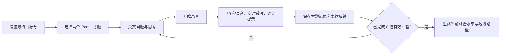
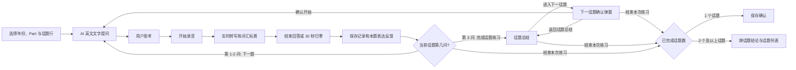
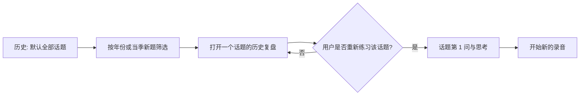

# 雅思口语 Part 1 AI 实时教官 MVP 交互稿

## 1. 文档目的

本文定义 Part 1 MVP 的页面、状态、操作和转场，供产品、设计和研发对齐。范围严格以 PRD 为准：用户答案只作为录音、转写和反馈记录保存，用于复盘和历史查看；不构建答案卡、个人素材库或跨题复用能力。

## 2. 交互原则

1. **一个阶段只让用户做一件事**：准备时只开始录音，录音时只结束回答，反馈后只选择下一题或结束。
2. **用户控制节奏**：常规练习中，AI 不会在单题反馈完成后自动展示下一题；用户主动点击“下一题”才继续。
3. **实时界面克制**：实时区只显示转写与黄色词汇表达提示。语法、句子结构和自然改写仅在复盘详情出现。
4. **话题不等于无限追问**：用户选择起始 Part 1 话题，AI 每次只展示当前一题；默认三问后切换话题，仅在回答信息不足时追加最多一问针对性追问。
5. **先话题后会话**：话题总结承担话题预估和分问题解析；结束页只处理保存确认或跨话题结论，避免重复复盘。
6. **记录不等于必须复练**：从历史话题进入时先展示历史训练；用户自行决定是否重新练习该话题。

## 3. 信息架构

```text
练习
  ├─ 首次诊断
  │   ├─ 设置最终目标分
  │   ├─ 选择两个话题
  │   ├─ 8 题完整 Part 1 诊断
  │   └─ 当前水平、阶段路径
  └─ 常规话题练习
      ├─ 选择年份（2026-2020）
      ├─ 选择该年份下的口语 Part（Part 1 / Part 2 / Part 3）
      ├─ 选择 Part 下的起始话题行（MVP 仅开放 Part 1）
      ├─ 当前问题
      ├─ 录音与实时转写
      ├─ 本题表达反馈
      ├─ 话题总结
      └─ 结束页（单话题保存确认 / 多话题跨话题结论）

历史
  └─ 默认全部历史训练（由新到旧）
      ├─ 按年份筛选（全部 / 2026-2020）
      └─ 按题目范围筛选（全部题目 / 仅当季新题）
      └─ 按话题打开话题复盘

目标
  └─ 当前水平、当前训练目标、最终目标与阶段路径
```

## 4. 页面与状态

| 编号 | 页面 / 状态 | 用户看到什么 | 主要操作 | 结果 |
| --- | --- | --- | --- | --- |
| S1 | 练习首页 | 页面名为“练习”；`2026-2020` 年份切换、所选年份下的 Part 1 / Part 2 / Part 3 选择，以及当前 Part 的话题行列表 | 先切换年份，再选择 Part 与起始话题行 | MVP 中 Part 1 进入 S3；Part 2、Part 3 显示暂未开放状态，不预览问题 |
| S2 | 首次诊断设置 | 最终目标分、两个话题选择 | 设置目标，选择两个话题，开始诊断 | 进入 S3 的诊断模式 |
| S3 | 问题与思考 | 当前英文问题、当前话题内题号（默认 `1/3` 至 `3/3`） | 开始录音 | 进入 S4；此时不启动倒计时 |
| S4 | 正在录音 | `00:30` 倒计时、持续更新的英文转写、稳定片段的黄色词汇提示 | 结束回答 | 停止录音，保存记录，进入 S5 |
| S5 | 本题表达反馈 | 左侧带黄色词汇标记的最终转录稿、右侧阶段匹配推荐回答、下方标黄词汇汇总、已保存状态 | 前两问为“下一题”；第三问为“完成话题练习”；均可结束本次练习 | 前两问进入 S3；第三问进入 S6；结束按已完成话题数进入 S7 或 S8；悬停标黄词汇时汇总区只展示对应词条，移开后恢复全部，不滚动页面 |
| S6 | 话题总结 | 话题训练预估（训练用途，非官方成绩）、话题汇总评价、预估判定依据与下次优化点；该话题每道追问的原始录音、转录稿、推荐回答和词汇汇总 | 结束本次练习 / 进入下一话题 | 结束按已完成话题数进入 S7 或 S8；进入下一话题先打开确认弹窗，确认后才进入 S3 |
| S7 | 结束页：单话题 | “本次练习已保存”、完成话题和回答数量；提示话题总结已提供预估与分问题解析 | 查看话题总结 / 选择其他话题 / 查看历史训练 | 不重复展示分数或逐题列表 |
| S8 | 结束页：多话题 | 会话训练预估、跨话题共同问题与下一次训练重点、已完成话题列表 | 打开某个话题总结 / 选择其他话题 / 查看历史训练 | 点击话题行进入 S6 的既有话题总结；不展示逐题表 |
| S9 | 历史 | 默认全部历史训练，按话题、最近练习时间由新到旧排序；年份与题目范围筛选 | 调整筛选，打开一个话题 | 筛选即时生效；打开后进入与 S6 同构的话题复盘，用户可自行开始该话题的新练习 |
| S10 | 目标与阶段 | 当前水平、当前训练目标、最终目标、阶段路径 | 修改当前训练目标或最终目标 | 保存后影响后续建议，不重写历史反馈 |

## 5. 关键流程

### 5.1 首次完整诊断



- 首次诊断必须完成两个话题、约 8 道有效回答，模拟 Part 1 的 4-5 分钟范围。
- 诊断途中退出时保存已完成记录和当前位置；不生成正式当前综合水平。
- 诊断题目不在选择话题时预览。

### 5.2 常规练习



- 练习首页按年份组织，目前提供 `2026` 至 `2020`。用户先选择年份，再选择口语 Part。入口保留 Part 1、Part 2 和 Part 3 的选择位置；本 MVP 只开放 Part 1，另外两个 Part 显示明确的暂未开放状态。选择 `2026` 的 Part 1 时展示“当季新题”；其他年份展示对应年份题目。
- 话题使用纵向条状列表展示，每一行是一个可开始练习的话题，不使用卡片网格。
- 常规练习中，每个话题默认三问。仅当用户回答的信息不足以自然衔接时，AI 可追加一问针对性追问；同一话题最多四问。
- 第三问（或可选的第四问）反馈页主操作为“完成话题练习”；点击后进入话题总结。总结页汇总本话题的所有追问，逐题从原始录音开始展示，再复用转录稿、推荐回答和词汇汇总。
- 只有在话题总结页点击“进入下一话题”才打开大确认弹窗；弹窗明确展示下一话题及“从第 1 问开始”。用户确认后才展示下一个话题首题，也可在弹窗中结束练习或返回话题总结。
- 结束练习时，如只完成一个话题，展示简洁的“本次练习已保存”确认，不重复话题训练预估或分问题内容；如完成两个及以上话题，才展示会话训练预估、跨话题共同问题、下一次训练重点和已完成话题列表。点击一个话题行回到该话题的既有总结。
- 一次模拟 Part 1 通常覆盖 2-3 个话题、总时长约 4-5 分钟。下一题由当前话题、上一题和上一轮回答生成；出现生成异常时，回退到同话题安全问题。

### 5.3 历史话题复盘



- 历史默认显示全部历史训练，按话题的最近练习时间由新到旧排序；可按 `2026-2020` 年份和“仅当季新题”筛选。
- 一个历史行对应一个年份下的话题。打开后复用话题总结的分问题解析样式，不触发自动复练。
- 新作答新增一条记录；历史录音、转写和反馈保持可查看。

## 6. S4 录音状态细则

| 元素 | 规则 |
| --- | --- |
| 倒计时 | 点击“开始录音”瞬间从 `00:30` 开始；归零后自动停止并保存已录内容。 |
| 转写 | 显示流式英文文本；最终转写完成后替换为稳定版本。 |
| 黄色标记 | 仅在识别稳定的词或短语上显示，且同时给出可替换的简短词汇表达。 |
| 录音状态 | 必须以文字和图形状态同时表达，不能只依赖红色或黄色。 |
| 异常 | 麦克风被拒绝时不开始倒计时，显示重新授权入口；转写延迟时保留录音并显示处理中状态。 |

## 7. S5、S6 与结束页的反馈边界

| 内容 | S5 本题表达反馈 | S6 话题总结 | S7 单话题结束页 | S8 多话题结束页 |
| --- | --- | --- | --- | --- |
| 训练预估分 | 不显示 | 顶部显示本话题训练预估，并标注训练用途、非官方成绩 | 不重复展示 | 显示本次会话训练预估，并标注训练用途、非官方成绩 |
| 评价范围 | 当前回答的词汇表达 | 当前话题的判定依据与下次优先优化点 | 仅确认保存完成 | 跨话题共同问题与下一次训练重点 |
| 分问题内容 | 转录稿标黄、下方汇总；悬停/聚焦/点击标黄词汇时，汇总区只展示对应建议；移开或失焦后恢复全部，不滚动页面 | 每道追问复用原始录音、转录稿、推荐回答和词汇汇总 | 不重复展示 | 不重复展示，只列出话题 |
| 推荐回答 | 在右侧与转录稿并列展示，保留原意并对齐当前训练目标 | 每道追问复用并列展示 | 不重复展示 | 不重复展示 |
| 主操作 | 前两问为下一题；第三问或可选第四问为完成话题练习；均可结束 | 结束本次练习 / 进入下一话题 | 查看话题总结 / 选择其他话题 / 查看历史训练 | 打开话题总结 / 选择其他话题 / 查看历史训练 |

## 8. 内容与文案规则

- 问题页仅展示英文问题；不展示中文译文、后续题目或示例答案。
- “话题训练预估”只在话题总结展示；“本次练习训练预估”只在完成两个及以上话题的结束页展示。二者都必须标注为训练用途，不承诺官方成绩。
- 所有词汇建议、详细改写与诊断建议按当前训练目标生成，不按最终目标分直接给出。
- 用户回答保存的内容为录音、最终转写、实时转写片段、黄色词汇标记、推荐回答和反馈；不生成独立的答案资产或素材库。

## 9. 原型覆盖范围

线框原型覆盖以下可点击路径：

1. 练习首页 -> 切换年份（2026-2020）-> 选择口语 Part -> 选择起始话题 -> 当前问题 -> 开始录音 -> 模拟实时转写 -> 结束回答 -> 转录稿/推荐回答/词汇联动反馈；MVP 的可用练习路径为 Part 1。
2. 前两题反馈 -> 下一题；第三题（或可选第四题）反馈 -> 完成话题练习 -> 话题总结 -> 进入下一话题确认，或在任意节点结束本次练习 -> 单话题保存确认 / 多话题跨话题结论 -> 话题总结。
3. 历史默认全部记录 -> 按年份或当季新题筛选 -> 按话题查看历史复盘 -> 自行重新练习该话题。
4. 首次诊断设置 -> 模拟完整诊断的入口和完成结果（不在练习首页以卡片形式展示）。
5. 目标 -> 修改当前训练目标。

原型不接入麦克风、语音识别、会话预估模型或真实 AI 服务；录音、转写、追问、推荐回答与会话预估以确定性示例模拟，用于验证界面信息层级和交互节奏。
